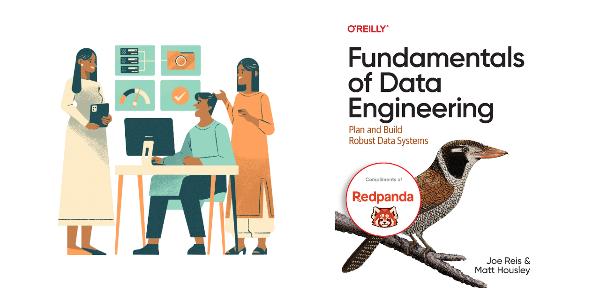

# learningFundamentalsOfDataEngineering

These are my notes from the book [Fundamentals Of Data Engineering](https://www.amazon.com/Fundamentals-Data-Engineering-Robust-Systems/dp/1098108302).



# Why ? 🤔

This is an amazing book for everyone who are involved in data.

By the end of the book you'll be better equipped to:

- Understand how data engineering fits into roles like data scientist, analyst, or engineer
- Cut through hype to choose the right tools, architectures, and processes
- Design robust systems using the data engineering lifecycle
- Apply data engineering principles in your day-to-day work
- Solve data problems using a lifecycle-based framework

Which is a pretty good deal. 🎉

I thought, I can share some of my highlights from it. If you want to discover more about any of the topics, please check out the book.

> If you’re interested in the book, you can purchase one. It was previously available [via Redpanda](https://go.redpanda.com/fundamentals-of-data-engineering), but the free copy is no longer offered. Now, that link redirects to a guide, which is still useful. 

# The Structure 🔨

The book consists of 3 parts, made up of 11 chapters and 2 appendices.

Here is the [tree](https://linux.die.net/man/1/tree) of the book.

```
Fundamentals of Data Engineering
├── Part 1 – Foundation and Building Blocks
│   ├── 1. Data Engineering Described
│   ├── 2. The Data Engineering Lifecycle
│   ├── 3. Designing Good Data Architecture
│   └── 4. Choosing Technologies Across the Data Engineering Lifecycle
├── Part 2 – The Data Engineering Lifecycle in Depth
│   ├── 5. Data Generation in Source Systems
│   ├── 6. Storage
│   ├── 7. Ingestion
│   ├── 8. Orchestration
│   └── 9. Queries, Modeling, and Transformation
└── Part 3 – Security, Privacy, and the Future of Data Engineering
    ├── 10. Security and Privacy
    └── 11. The Future of Data Engineering
```

The following are my notes about the book.

# Part 1 – Foundation and Building Blocks

<div style="display: flex; align-items: center;">
  <div style="flex: 1;">
    <p><strong>Let's discover.</strong><br></p>
  </div>
  <div style="flex: 1;">
    
  </div>
</div>

## 1. Data Engineering Described

Let's clarify why we are here.

### Definition of Data Engineer

Who is a data engineer? Here is Joe's and Matt's definition:

_Data engineering is the development, implementation, and maintenance of systems and processes that take in raw data and produce high-quality, consistent information that supports downstream use cases, such as analysis and machine learning._

_Data engineering is the intersection of security, data management, DataOps, data architecture, orchestration, and software engineering. A data engineer manages the data engineering lifecycle, beginning with getting data from source systems and ending with serving data for use cases, such as analysis or machine learning._

### Data Engineering Lifecycle

The book is centered around an idea called the **data engineering lifecycle** (Figure 1-1), which gives data engineers the holistic context to view their role.

<p align="center">
  
</p>

So the book is going to dive deep in the 5 stages and consider the undercurrents of all of these:

- Generation
- Storage
- Ingestion
- Transformation
- Serving

I believe this is a fantastic way to see the field, free from any single technology and it helps us focus the end goal. 🥳

### Evolution of the Data Engineer

This bit gives us a history for the Data Engineering field.

Most important points are:

- The birth of Data Warehousing (1989 - Bill Inmon) - first age of scalable analytics 
- Commodity hardware—such as servers, RAM and disks becoming cheaper
- Distributed computation and storage on massive computing clusters becoming mainstream at a vast scale.
- Google File System and Apache Hadoop
- Cloud Compute and Storage becoming popular on AWS, Google Cloud and Microsoft Azure
- Open source big data tools in the Hadoop ecosystem rapidly spreading

Data engineers managing the data engineering lifecycle have better tools and techniques than ever before. All we have to do is to master them. 😌

### Data Hierarchy Of Needs

Another crucial idea to understand is the Data Hierarchy Of Needs:

<p align="center">
  
</p>

Even though almost everyone is focused on AI/ML applications, a strong Data Engineering Team should provide them with a infrastructure that has:

- Instrumentation, Logging, Support a Variety of Data Sources.
- Reliable Data Flow, Cleaning. 
- Monitoring & Useful Metrics.

These are really simple things, but they can be really hard to implement in complex systems.

As an engineer, we work under constraints. We must optimize along these axes:

- Cost
- Agility
- Scalability
- Simplicity
- Reuse
- Interoperability

### Data Maturity

Another great idea from this chapter is Data Maturity.

Data Maturity refers to the organization's advancement in utilizing, integrating, and maximizing data capabilities. Data maturity isn’t determined solely by a company’s age or revenue; an early-stage startup may demonstrate higher data maturity than a century-old corporation with billions in annual revenue.

What truly matters is how effectively the company leverages data **as a competitive advantage**.

### How to become a Data Engineer ? 🥳

Data engineering is a rapidly growing field, but lacks a formal training path. Universities don't offer standardized programs, and while boot camps exist, a unified curriculum is missing. 

People enter the field with diverse backgrounds, often transitioning from roles like software engineering or data analysis, and **self-study** is crucial. 🏂

A data engineer must master data management, technology tools, and understand the needs of data consumers like analysts and scientists. Success in data engineering requires both technical expertise and a broader understanding of the business impact of data.

#### Business Responsibilities:

- Know how to communicate with nontechnical and technical people.
- Understand how to scope and gather business and product requirements.
- Understand the cultural foundations of Agile, DevOps, and DataOps.
- Control costs.
- Learn continuously.

A successful data engineer always zooms out to understand the big picture and how to achieve outsized value for the business.

#### Technical Responsibilities:

Data engineers remain software engineers, in addition to their many other roles.

What languages should a data engineer know?

- SQL: lingua franca of data
- Python: Bridge between Data Engineering and Data Science.
- JVM languages such as Java and Scala: Crucial for open source data frameworks.
- bash: cli of Linux OS. Which is the leading operating system on servers (over 96.4% of the top one million web servers' operating systems [are Linux](https://en.wikipedia.org/wiki/Linux#:~:text=Linux%20is%20the%20leading%20operating,having%20gradually%20displaced%20all%20competitors).).

### Data Engineers and Other Technical Roles

It is important to understand the technical stakeholders that you'll be working with.

<p align="center">
  
</p>

The crucial idea is that, you are a part of a bigger team. As a unit, you are trying to achieve something. 🏉

A great tactic would be to understand the workflows of those people which sits at the upstream or downstream of your work.

### Data Engineers and Leadership

Data engineers act as connectors within organizations, bridging business and data teams. They now play a key role in strategic planning, helping align business goals with data initiatives and supporting data architects in driving data-centric projects.

#### Data in the C-Suite

C-level executives increasingly recognize data as a core asset.

- CEO: Collaborates with technical leaders on high-level data strategies without delving into technical details.
- CIO: Manages internal IT and works with data engineers on initiatives like cloud migrations and IT strategy.
- CTO: Focuses on external-facing technologies, collaborating with data engineers to integrate data sources like mobile and web apps.
- CDO: Oversees data strategy, governance, and initiatives, ensuring data's business utility.
- CAO: Specializes in analytics, strategy, and decision-making, often overseeing data science and ML.

### Conclusion

Now we know about:

- What is a Data Engineer and what does s/he do
- The Lifecycle they use
- The people they work with

Let's dive deep on the lifecycle.

## 2. The Data Engineering Lifecycle. 🐦

We can move beyond viewing data engineering as a specific collection of data technologies, which is a big trap. 😮

We can think with data engineering lifecycle. 💯

It shows the stages that turn raw data ingredients into a useful end product, ready for consumption by analysts, data scientists, ML engineers, and others.

Let's remember the figure for the data engineering lifecycle.

<p align="center">
  
</p>

In the following chapters we'll dive deep for each of these stages, but let's learn the **useful questions to ask** about them first.

### Generation: Source Systems 🌊

A source system is where data originates in the data engineering process. 

Examples of source systems include IoT devices, application message queues, or transactional databases.

Data engineers use data from these source systems but typically **do not own or control them**.

Therefore, it's important for data engineers to understand how these source systems operate, how they generate data, how frequently and quickly they produce data (frequency and velocity), and the different types of data they generate.

#### Here is a set of evaluation questions for Source Systems:

- What are the essential characteristics of the data source? Is it an application? A swarm of IoT devices?
- How is data persisted in the source system? Is data persisted long term, or is it temporary and quickly deleted?
- At what rate is data generated? How many events per second? How many gigabytes per hour?
- What level of consistency can data engineers expect from the output data? If you’re running data-quality checks against the output data, how often do data inconsistencies occur—nulls where they aren’t expected, lousy formatting, etc.?
- How often do errors occur?
- Will the data contain duplicates?
- Will some data values arrive late, possibly much later than other messages produced simultaneously?
- What is the schema of the ingested data? Does a join across several tables or even several systems needed to get a complete picture of the data?
- If schema changes (say, a new column is added), how is this dealt with and communicated to downstream stakeholders?
- How frequently should data be pulled from the source system? Will **Ingestion** be a thread for source system in terms of resource contention?
- For stateful systems (e.g., a database tracking customer account information), is data provided as periodic snapshots or update events from change data capture (CDC)? What’s the logic for how changes are performed, and how are these tracked in the source database?
- Who/what is the data provider that will transmit the data for downstream consumption?
- Will reading from a data source impact its performance?
- Does the source system have upstream data dependencies? What are the characteristics of these upstream systems?
- Are data-quality checks in place to check for late or missing data?

We'll learn more about Source Systems in Chapter 5.

### Storage 🌱

Choosing the right data storage solution is critical yet complex in data engineering because it affects all stages of the data lifecycle. 

Cloud architectures often use multiple storage systems that offer capabilities beyond storage, like data transformation and querying. 

Storage intersects with other stages such as ingestion, transformation, and serving, influencing how data is used throughout the entire pipeline.

#### Here is a set of evaluation questions for Storage:

- Is the storage solution compatible with the architecture’s required read and write speeds to prevent bottlenecks in downstream processes?
- Are we utilizing the storage technology optimally without causing performance issues (e.g., avoiding high rates of random access in object storage systems)?
- Can the storage system handle anticipated future scale in terms of capacity limits, read/write operation rates, and data volume?
- Will downstream users and processes be able to retrieve data within the required service-level agreements (SLAs)?
- Are we capturing metadata about schema evolution, data flows, and data lineage to enhance data utility and support future projects?
- Is this a pure storage solution, or does it also support complex query patterns (like a cloud data warehouse)?
- Does the storage system support schema-agnostic (object storage) storage, flexible schemas (Cassandra), or enforced schemas (DWH)?
- How are we tracking master data, golden records, data quality, and data lineage for data governance?
- How are we handling regulatory compliance and data sovereignty, such as restrictions on storing data in certain geographical locations?

Regardless of the storage type, the temperature of data is a good frame to interpret storage and data.

Data access frequency defines data "temperatures": Hot data is frequently accessed and needs fast retrieval; lukewarm data is accessed occasionally; cold data is rarely accessed and suited for archival storage. Cloud storage tiers match these temperatures, balancing cost with retrieval speed.

We'll learn more about Storage in Chapter 6.

### Ingestion 🧘‍♂️

Data ingestion from source systems is a critical stage in the data engineering lifecycle and often represents the ***biggest bottleneck***. Source systems are typically outside of our control and may become unresponsive or provide poor-quality data. 

Ingestion services might also fail for various reasons, halting data flow and impacting storage, processing, and serving stages. These unreliabilities can ripple across the entire lifecycle, but if we've addressed the key questions about source systems, we can better mitigate these challenges.

#### Here is a set of evaluation questions for Ingestion:

- What are the purposes of the data we are ingesting? Can we utilize this data without creating multiple versions of the same dataset?
- Do the systems that generate and ingest this data operate reliably, and is the data accessible when needed?
- After ingestion, where will the data be stored or directed?
- How often will we need to access or retrieve the data?
- What is the typical volume or size of the data that will be arriving?
- In what format is the data provided, and can the downstream storage and transformation systems handle this format?
- Is the source data ready for immediate use downstream? If so, for how long will this be the case, and what could potentially make it unusable?

Batch processing is often preferred over streaming due to added complexities and costs; real-time streaming should be used only when necessary. 

Data ingestion involves push models (source sends data) and pull models (system retrieves data), often combined in pipelines.  Traditional ETL uses the pull model. 

Continuous ***Change Data Capture*** (CDC) can be push-based (triggers on data changes) or pull-based (reading logs). 

Streaming ingestion pushes data directly to endpoints, ideal for scenarios like IoT sensors emitting events, simplifying real-time processing by treating each data point as an event.

We'll learn more about Ingestion in Chapter 7.

### Transformation 🔨

After data is ingested and stored, it must be transformed into usable formats for downstream purposes like reporting, analysis, or machine learning. 

Transformation converts raw, inert data into valuable information by correcting data types, standardizing formats, removing invalid records, and preparing data for further processing.

This preparation can be applying normalization, performing large-scale aggregations for reports or extracting features for ML  models.

#### Here is a set of evaluation questions for Transformation:

- What are the business requirements and use cases for the transformed data?
- What data quality issues exist, and how will they be addressed?
- What transformations are necessary to make the data usable?
- What are the source data formats, and what formats are required by downstream systems?
- Are there schema changes needed during transformation?
- How will we handle varying data types and ensure correct type casting?
- What is the expected data volume, and how will it affect processing performance?
- Which tools and technologies are best suited for the transformation tasks?
- How will we manage and track *data lineage* (history and life cycle of data as it moves through in the data pipeline) and provenance ?
- What are the performance requirements and SLAs for the transformation process?
- Are there regulatory compliance or security considerations?
- How can we validate and test the transformed data for accuracy and completeness?
- What error handling and logging mechanisms will be in place?
- Is real-time or batch processing required?
- How can we handle changes in source data schemas or structures over time?
- How will the transformed data be stored and accessed downstream?
- What documentation is needed for the transformation logic and pipeline architecture?
- How should we you monitor and maintain the transformation pipeline over time?
- What are the data governance policies that need to be enforced during transformation?
- How can we ensure scalability of the transformation process as data volumes grow?
- Are there any data enrichment (integrating additional data sources to enhance the value of the transformed data) opportunities during transformation?
- How can we secure data during transformation to prevent unauthorized access?

Transformation often overlaps with other stages of the data lifecycle, such as ingestion, where data may be enriched or formatted on the fly. Business logic plays a significant role in shaping transformations, especially in data modeling, to provide clear insights into business processes and ensure consistent implementation across systems. 

Additionally, data featurization is an important transformation for machine learning, involving the extraction and enhancement of data features for model training—a process that data engineers can automate once defined by data scientists.

We'll learn more about Transformation in Chapter 8.

### Serving Data 🤹

After data is ingested, stored, and transformed, the goal is to derive practical value from it.

In the beginning of the book, we've seen how data engineering is enabling predictive analysis, descriptive analytics, and reports.

With simple terms, here is what they are:

- **Predictive Analysis**: Uses historical data and statistical models to forecast future events or trends.
- **Descriptive Analytics**: Examines past data to understand and summarize what has already occurred.
- **Reports**: Compile and present data and insights in a structured format for informed decision-making.

#### Here is a set of questions to make a solid Serving Stage:

- What are the primary business goals we aim to achieve with this data?
- Who are the key stakeholders, and how will they use the data?
- Which specific use cases will the data serving support (e.g., reporting, machine learning, real-time analytics)?
- How does the data align with our overall business strategy and priorities?
- What data validation and cleansing processes are in place to maintain quality?
- How do we handle data inconsistencies or errors in the serving stage?
- Who needs access to the data, and what are their access levels?
- What access controls and permissions are required to secure the data?
- What reporting tools and dashboards will be used to visualize the data?
- How can we enable self-service analytics for business users without compromising data security?
- What key performance indicators (KPIs) and metrics should be tracked?
- Do we need to implement a feature store to manage and serve features for ML?
- How will we handle feature versioning and sharing across teams?
- What security measures are in place to protect sensitive and confidential data?
- How do we ensure compliance with data privacy regulations (e.g., GDPR, CCPA)?
- What encryption methods are used for data at rest and in transit?
- What latency requirements do we have for data access and real-time analytics?
- Are there performance monitoring tools in place to track and optimize data serving?
- How are responsibilities divided between data engineering, ML engineering, and analytics teams?


ML is cool, but it’s generally best to develop competence in analytics before moving to ML.

We'll dive deep on Serving in Chapter 9.

### The Undercurrents

Data engineering is evolving beyond just technology, integrating traditional practices like data management and cost optimization with newer approaches such as DataOps. 

These key "undercurrents"—including security, data architecture, orchestration, and software engineering—support the **entire data engineering lifecycle**. 

Let's talk about them in single sentences, and we'll go into explore them in greater detail throughout the book.

<p align="center">
  
</p>


#### Security

Security is paramount in data engineering, requiring engineers to enforce the principle of least privilege, cultivate a security-focused culture, implement robust access controls and encryption, and possess comprehensive security administration skills to effectively protect sensitive data.

#### Data Management

Modern data engineering integrates comprehensive data management practices—such as governance and lifecycle management—transforming it from a purely technical role into a strategic function essential for treating data as a vital organizational asset.

#### DataOps

DataOps applies Agile and DevOps principles to data engineering by fostering a collaborative culture and implementing automation, monitoring, and incident response practices to enhance the quality, speed, and reliability of data products.

#### Data Architecture

Data architecture is a fundamental aspect of data engineering that involves understanding business requirements, designing cost-effective and simple data systems, and collaborating with data architects to support an organization’s evolving data strategy.

#### Orchestration

Orchestration in DataOps is the coordinated management of data jobs using systems like Apache Airflow to handle dependencies, scheduling, monitoring, and automation, ensuring efficient and reliable execution of data workflows.

#### Software Engineering

Software engineering is fundamental to data engineering, encompassing the development and testing of data processing code, leveraging and contributing to open source frameworks, managing streaming complexities, implementing infrastructure and pipelines as code, and addressing diverse technical challenges to support and advance evolving data systems.

### Conclusion

The data engineering lifecycle, supported by key undercurrents such as security, data management, DataOps, architecture, orchestration, and software engineering, provides a comprehensive framework for data engineers to optimize ROI, reduce costs and risks, and maximize the value and utility of data.

Let's learn to think with this mindset! 🌠

## 3. Designing Good Data Architecture

The authors talk about the need for defining Enterprise Architecture before Data Architecture. Here are the definitions:

- **Enterprise architecture** is the design of systems to support change in the enterprise, achieved by flexible and reversible decisions reached through careful evaluation of trade-offs.

- **Data architecture** is the design of systems to support the evolving data needs of an enterprise, achieved by flexible and reversible decisions reached through a careful evaluation of trade-offs.

We can divide Data Architecture into two parts, Operational and Technical:

Operational architecture involves the practical needs related to people, processes, and technology. For example, it looks at which business activities the data supports, how the company maintains data quality, and how quickly data needs to be available for use after it's created. 

On the other hand, technical architecture explains the methods for collecting, storing, changing, and delivering data throughout its lifecycle. For example, it might describe how to move 10 TB of data every hour from a source database to a data lake. 

In short, operational architecture defines what needs to be done, while technical architecture explains how to do it.

Effective data architecture meets business needs by using standardized, reusable components while remaining adaptable and balancing necessary compromises.

Effective data architecture is dynamic and continually evolving. It is never truly complete. 

By definition, adaptability and growth are fundamental to the essence and objectives of data architecture. 

Next, let's explore the principles that underpin good data architecture.

### Principles of Good Data Architecture

#### 1: Choose Common Components Wisely

A key responsibility of data engineers is selecting shared components and practices—such as object storage, version control systems, observability tools, orchestration platforms, and processing engines—that are widely usable across the organization. 

Effective selection promotes collaboration, breaks down silos, and enhances flexibility by leveraging common knowledge and skills. These shared tools should be accessible to all relevant teams, encouraging the use of existing solutions over creating new ones, while ensuring robust permissions and security to safely share resources. 

Cloud platforms are ideal for implementing these components, allowing teams to access a common storage layer with specialized tools for their specific needs. 

Balancing organizational-wide requirements with the flexibility for specialized tasks is essential to support various projects and foster collaboration without imposing one-size-fits-all solutions. Further details are provided in Chapter 4.

#### 2: Plan for Failure

Modern hardware is generally reliable, but failures are inevitable over time. 

To build robust data systems, it's essential to design with potential failures in mind by understanding key concepts such as availability (the percentage of time a service is operational), reliability (the likelihood a system performs its intended function), recovery time objective (the maximum acceptable downtime), and recovery point objective (the maximum acceptable data loss).

These factors guide engineers in making informed architectural decisions to effectively handle and mitigate failure scenarios, ensuring systems remain resilient and meet business requirements.

#### 3: Architect for Scalability

Scalability in data systems means the ability to automatically increase capacity to handle large data volumes or temporary spikes and decrease it to reduce costs when demand drops. 

Elastic systems adjust dynamically, sometimes even scaling to zero when not needed, as seen in serverless architectures. However, choosing the right scaling strategy is essential to avoid complexity and high costs. This requires carefully assessing current usage, anticipating future growth, and selecting appropriate database architectures to ensure efficiency and cost-effectiveness as the organization expands.

#### 4: Architecture Is Leadership

Data architects combine strong technical expertise with leadership and mentorship to make technology decisions, promote flexibility and innovation, and guide data engineers in achieving organizational goals.

#### 5: Always Be Architecting

Data architects continuously design and adapt architectures in an agile, collaborative way, responding to business and technology changes by planning and prioritizing updates.

#### 6: Build Loosely Coupled Systems

Loose coupling through independent components and APIs allows teams to collaborate efficiently and evolve systems flexibly.

#### 7: Make Reversible Decisions

To stay agile in a rapidly changing data landscape, architects should make reversible decisions that keep architectures simple and adaptable.

#### 8: Prioritize Security

Data engineers must take responsibility for system security by adopting [zero-trust models](https://www.microsoft.com/en-us/security/business/zero-trust) and the [shared responsibility](https://aws.amazon.com/compliance/shared-responsibility-model/) approach, ensuring robust protection in cloud-native environments and preventing breaches through proper configuration and proactive security practices.

#### 9: Embrace FinOps

FinOps is a cloud financial management practice that encourages collaboration between engineering and finance teams to optimize cloud spending through data-driven decisions and continuous cost monitoring.

We should embrace it!

Now that we have a grasp of the fundamental principles of effective data architecture, let's explore the key concepts necessary for designing and building robust data systems in more detail.


### Major Architecture Concepts

To learn more about:

- Domains and Services
- Distributed Systems, Scalability, and Designing for Failure
- Tight Versus Loose Coupling: Tiers, Monoliths, and Microservices
- User Access: Single Versus Multitenant
- Event-Driven Architecture
- Brownfield Versus Greenfield Projects

please read this part. 🥰

Next, we’ll explore different types of architectures.

### Examples and Types of Data Architecture

Here, we can explore some 101 information about:

- Data Warehouse
- Data Marts
- Data Lake
- Data Lakehouses
- The Modern Data Stack
- Lambda Architecture
- Kappa Architecture
- The Dataflow Model and Unified Batch and Streaming
- Architecture for IoT
- Data Mesh

We have learned how data architecture fits into the data engineering lifecycle, what constitutes good data architecture, and examined several examples of different architectures. 

Because architecture is a key foundation for success, we should invest time to study it deeply and understand the inherent trade-offs. This preparation enables us to design architectures that meet our organization’s unique requirements. 

Next, we’ll explore approaches to selecting the right technologies for our data architecture and throughout the data engineering lifecycle. 😍

## 4. Choosing Technologies Across the Data Engineering Lifecycle

Chapter 3 explored the concept of “good” data architecture and its importance. 

Now, we shift focus to selecting the right technologies to support this architecture. 

For data engineers, choosing the right tools is crucial for building high-quality data products. The key question to ask when evaluating a technology is straightforward: Does it add value to the data product and the broader business? 💡

One common misconception is equating architecture with tools. 

**Architecture** is strategic, while **tools** are tactical.

- Architecture is the high-level design, roadmap, and blueprint that guides how data systems align with strategic business objectives. It answers the what, why, and when of data systems. 

- Tools, on the other hand, are the how—the practical means of implementing the architecture.

### Key Factors for Choosing Data Technologies

When selecting technologies to support your data architecture, consider the following across the data engineering lifecycle:

- ***Team Size and Capabilities***: Can your team effectively manage and scale the technology? 👥

- ***Speed to Market***: Does it help deliver results quickly? 🚀

- ***Interoperability***: How well does it integrate with existing systems? 🔗

- ***Cost Optimization and Business Value***: Is the cost justified by the value it provides? 💰

- ***Today vs. Future***: Is the technology immutable (long-term) or transitory (short-term)? 📅

- ***Deployment Location***: Cloud, on-premises, hybrid, or multicloud—what fits best? ☁️🏢

- ***Build vs. Buy***: Should you create a custom solution or use an off-the-shelf tool? 🛠️🛒

- ***Monolith vs. Modular***: Is a single unified system better, or should it be broken into smaller, interchangeable parts? 🧱

- ***Serverless vs. Servers***: Which offers better scalability and cost efficiency for your use case? ⚙️

- ***Optimization and Performance***: How does the technology perform, and how does it compare in benchmarks? 🏎️

- ***The Undercurrents of the Data Engineering Lifecycle***: Consider hidden complexities and future challenges. 🌊

These points might be helpful for you to demnostrate that your approach is rooted in industry best practices and aligned with the system’s goals.

# Part 2 – The Data Engineering Lifecycle in Depth

Then we move onto the second part of the book.

## 5. Data Generation in Source Systems

Before getting the raw data, you must understand where the data exists, how it is generated, and its characteristics.

Let's make sure we get the absolute basics right.

### Main Ideas on Source Systems

#### Files

A file is a sequence of bytes, typically stored on a disk. Applications often write data to files. Files may store local parameters, events, logs, images, and audio.

In addition, files are a universal medium of data exchange. As much as data engineers wish that they could get data programmatically, much of the world still sends and receives files.

#### APIs

Application programming interfaces (APIs) are a standard way of exchanging data between systems.

## 6. Storage

## 7. Ingestion

## 8. Queries, Modeling, and Transformation

## 9. Serving Data for Analytics, Machine Learning, and Reverse ETL

# Part 3 – Security, Privacy, and the Future of Data Engineering

The final part of the book is about Security, Privacy, and the Future of Data Engineering

## 10. Security and Privacy

## 11. The Future of Data Engineering

## A. Serialization and Compression Technical Details

## B. Cloud Networking

## Summary

## Closing 

So grateful that this book exists. Thanks to [Joe Reis](https://joereis.substack.com/) and [Matt Housley](https://www.linkedin.com/in/housleymatthew/).
