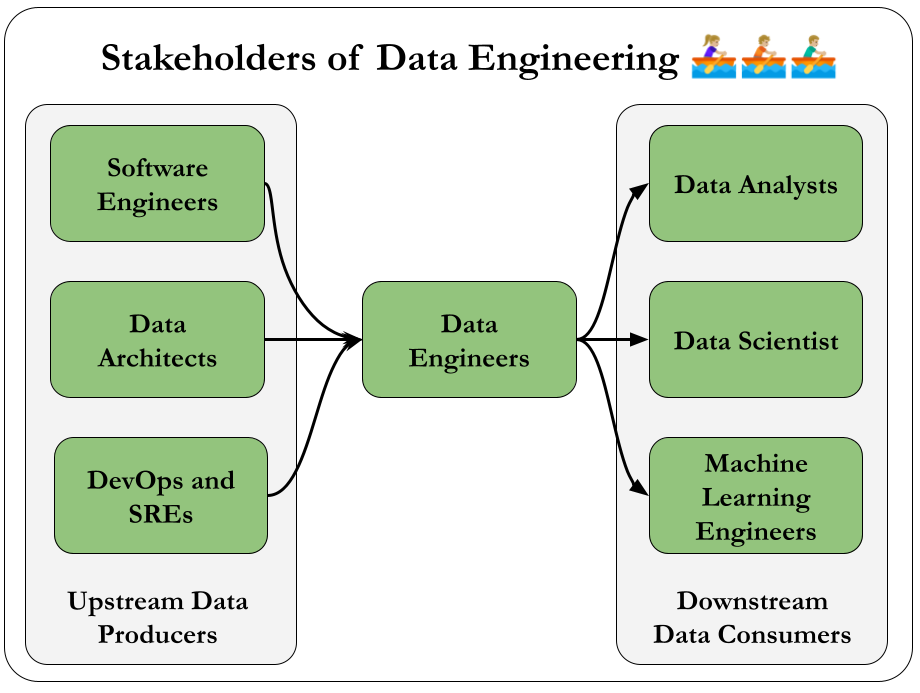
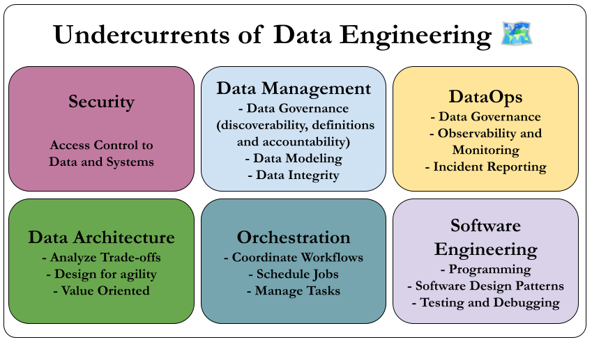

# learningFundamentalsOfDataEngineering

These are my notes from the book Fundamentals Of Data Engineering.

# Why ?

This is an amazing book for everyone who are involved in data.

I thought, I can share some of my highlights from it. If you want to discover more about any of the topics, please check out the book.

I am so grateful that this book exists. It changed my life. Thanks to [Joe Reis](https://joereis.substack.com/) and [Matt Housley](https://www.linkedin.com/in/housleymatthew/).

If you’re interested in the book, you can purchase one, but you can also get a free copy at [the RedPanda website](https://go.redpanda.com/fundamentals-of-data-engineering).

# The summary and the keypoints

The book consists of 3 parts, made up of 11 chapters and 2 appendices.

> The First part of the book is about Foundation and Building Blocks. 

## 1. Data Engineering Described

### Definition of Data Engineer

Who is a data engineer? Here is Joe's and Matt's definition:

_Data engineering is the development, implementation, and maintenance of systems and processes that take in raw data and produce high-quality, consistent information that supports downstream use cases, such as analysis and machine learning._

_Data engineering is the intersection of security, data management, DataOps, data architecture, orchestration, and software engineering. A data engineer manages the data engineering lifecycle, beginning with getting data from source systems and ending with serving data for use cases, such as analysis or machine learning._

### Data Engineering Lifecycle

The book is centered around an idea called the **data engineering lifecycle** (Figure 1-1), which gives data engineers the holistic context to view their role.

  

So the book is going to dive deep in the 5 stages and consider the undercurrents of all of these:

- Generation
- Storage
- Ingestion
- Transformation
- Serving

I believe this is a fantastic way to see the field, free from any single technology and it helps us focus the end goal. 🥳

### Evolution of the Data Engineer

This bit gives us a history for the Evolution of the Data Engineer.

Most important points are:

- The birth of Data Warehousing
- Commodity hardware—such as servers, RAM and disks becoming cheaper
- Distributed computation and storage on massive computing clusters becoming mainstream at a vast scale.
- Google File System and Apache Hadoop
- Cloud Compute and Storage becoming popular on AWS, Google Cloud and Microsoft Azure
- Open source big data tools in the Hadoop ecosystem rapidly spreading

Data engineers managing the data engineering lifecycle have better tools and techniques than ever before. All we have to do is to master them. 😌

### Data Hierarchy Of Needs

Another crucial idea to understand is the Data Hierarchy Of Needs:

  

Even though almost everyone is focused on AI/ML applications, a strong Data Engineering Team should provide them with a infrastructure that has:

- Instrumentation, Logging, Support a Variety of Data Sources.
- Reliable Data Flow, Cleaning. 
- Monitoring & Useful Metrics.

These are really simple things, but they can be really hard to implement in complex systems.

As an engineer, we work under constraints. We must optimize along these axes:

- Cost
- Agility
- Scalability
- Simplicity
- Reuse
- Interoperability

### Data Maturity

Another great idea from this chapter is Data Maturity.

Data Maturity refers to the organization's advancement in utilizing, integrating, and maximizing data capabilities. Data maturity isn’t determined solely by a company’s age or revenue; an early-stage startup may demonstrate higher data maturity than a century-old corporation with billions in annual revenue. 

What truly matters is how effectively the company leverages data **as a competitive advantage**.

TODO Write more on Data Maturity.

### How to become a Data Engineer ? 🥳

Data engineering is a rapidly growing field, but lacks a formal training path. Universities don't offer standardized programs, and while boot camps exist, a unified curriculum is missing. People enter the field with diverse backgrounds, often transitioning from roles like software engineering or data analysis, and self-study is crucial.

A data engineer must master data management, technology tools, and understand the needs of data consumers like analysts and scientists. Success in data engineering requires both technical expertise and a broader understanding of the business impact of data.

#### Here are the Business Responsibilities:

- Know how to communicate with nontechnical and technical people.
- Understand how to scope and gather business and product requirements.
- Understand the cultural foundations of Agile, DevOps, and DataOps.
- Control costs.
- Learn continuously.

A successful data engineer always zooms out to understand the big picture and how to achieve outsized value for the business.

#### Here are Technical Responsibilities

Data engineers remain software engineers, in addition to their many other roles.

What languages should a data engineer know?

- SQL,M Python, JVM languages such as Java and Scala, bash

### Data Engineers and Other Technical Roles

It is important to understand the technical stakeholders that you'll be working with.

  

See all the details within the section.

### Data Engineers and Leadership

Data engineers act as connectors within organizations, bridging business and data teams. They now play a key role in strategic planning, helping align business goals with data initiatives and supporting data architects in driving data-centric projects.

#### Data in the C-Suite

C-level executives increasingly recognize data as a core asset.

- CEO: Collaborates with technical leaders on high-level data strategies without delving into technical details.
- CIO: Manages internal IT and works with data engineers on initiatives like cloud migrations and IT strategy.
- CTO: Focuses on external-facing technologies, collaborating with data engineers to integrate data sources like mobile and web apps.
- CDO: Oversees data strategy, governance, and initiatives, ensuring data's business utility.
- CAO: Specializes in analytics, strategy, and decision-making, often overseeing data science and ML.

## 2. The Data Engineering Lifecycle. 🐦

We can move beyond viewing data engineering as a specific collection of data technologies. We can think with data engineering lifecycle.

The data engineering lifecycle comprises stages that turn raw data ingredients into a useful end product, ready for consumption by analysts, data scientists, ML engineers, and others.

Let's remember the figure for the data engineering lifecycle.

  

In the following chapters we'll dive deep for each of these stages, but let's first learn the useful questions to ask about them.

### Generation: Source Systems

A source system is where data originates in the data engineering process. Examples of source systems include IoT devices, application message queues, or transactional databases. 

Data engineers use data from these source systems but typically **do not own or control them**. 

Therefore, it's important for data engineers to understand how these source systems operate, how they generate data, how frequently and quickly they produce data (frequency and velocity), and the different types of data they generate.

#### Here is a wonderful set of evaluation questions:

- What are the essential characteristics of the data source? Is it an application? A swarm of IoT devices?
- How is data persisted in the source system? Is data persisted long term, or is it temporary and quickly deleted?
- At what rate is data generated? How many events per second? How many gigabytes per hour?
- What level of consistency can data engineers expect from the output data? If you’re running data-quality checks against the output data, how often do data inconsistencies occur—nulls where they aren’t expected, lousy formatting, etc.?
- How often do errors occur?
- Will the data contain duplicates?
- Will some data values arrive late, possibly much later than other messages produced simultaneously?
- What is the schema of the ingested data? Does a join across several tables or even several systems needed to get a complete picture of the data?
- If schema changes (say, a new column is added), how is this dealt with and communicated to downstream stakeholders?
- How frequently should data be pulled from the source system? Will **Ingestion** be a thread for source system in terms of resource contention?
- For stateful systems (e.g., a database tracking customer account information), is data provided as periodic snapshots or update events from change data capture (CDC)? What’s the logic for how changes are performed, and how are these tracked in the source database?
- Who/what is the data provider that will transmit the data for downstream consumption?
- Will reading from a data source impact its performance?
- Does the source system have upstream data dependencies? What are the characteristics of these upstream systems?
- Are data-quality checks in place to check for late or missing data?

We'll learn more about Source Systems in Chapter 5.

### Storage

Choosing the right data storage solution is critical yet complex in data engineering because it affects all stages of the data lifecycle. 

Cloud architectures often use multiple storage systems that offer capabilities beyond storage, like data transformation and querying. 

Storage intersects with other stages such as ingestion, transformation, and serving, influencing how data is used throughout the entire pipeline.

#### Here is a set of evaluation questions for Storage:

- Is the storage solution compatible with the architecture’s required read and write speeds to prevent bottlenecks in downstream processes?
- Are we utilizing the storage technology optimally without causing performance issues (e.g., avoiding high rates of random access in object storage systems)?
- Can the storage system handle anticipated future scale in terms of capacity limits, read/write operation rates, and data volume?
- Will downstream users and processes be able to retrieve data within the required service-level agreements (SLAs)?
- Are we capturing metadata about schema evolution, data flows, and data lineage to enhance data utility and support future projects?
- Is this a pure storage solution, or does it also support complex query patterns (like a cloud data warehouse)?
- Does the storage system support schema-agnostic (object storage) storage, flexible schemas (Cassandra), or enforced schemas (DWH)?
- How are we tracking master data, golden records, data quality, and data lineage for data governance?
- How are we handling regulatory compliance and data sovereignty, such as restrictions on storing data in certain geographical locations?

Regardless of the storage type, the temperature of data is a good frame to interpret storage and data.

Data access frequency defines data "temperatures": Hot data is frequently accessed and needs fast retrieval; lukewarm data is accessed occasionally; cold data is rarely accessed and suited for archival storage. Cloud storage tiers match these temperatures, balancing cost with retrieval speed.

We'll learn more about Storage in Chapter 6.

### Ingestion

Data ingestion from source systems is a critical stage in the data engineering lifecycle and often represents the ***biggest bottleneck***. Source systems are typically outside of our control and may become unresponsive or provide poor-quality data. 

Ingestion services might also fail for various reasons, halting data flow and impacting storage, processing, and serving stages. These unreliabilities can ripple across the entire lifecycle, but if we've addressed the key questions about source systems, we can better mitigate these challenges.

#### Here is a set of evaluation questions for Ingestion:

- What are the purposes of the data we are ingesting? Can we utilize this data without creating multiple versions of the same dataset?
- Do the systems that generate and ingest this data operate reliably, and is the data accessible when needed?
- After ingestion, where will the data be stored or directed?
- How often will we need to access or retrieve the data?
- What is the typical volume or size of the data that will be arriving?
- In what format is the data provided, and can the downstream storage and transformation systems handle this format?
- Is the source data ready for immediate use downstream? If so, for how long will this be the case, and what could potentially make it unusable?

Batch processing is often preferred over streaming due to added complexities and costs; real-time streaming should be used only when necessary. 

Data ingestion involves push models (source sends data) and pull models (system retrieves data), often combined in pipelines.  Traditional ETL uses the pull model. 

Continuous ***Change Data Capture*** (CDC) can be push-based (triggers on data changes) or pull-based (reading logs). 

Streaming ingestion pushes data directly to endpoints, ideal for scenarios like IoT sensors emitting events, simplifying real-time processing by treating each data point as an event.

We'll learn more about Ingestion in Chapter 7.

### Transformation

After data is ingested and stored, it must be transformed into usable formats for downstream purposes like reporting, analysis, or machine learning. 

Transformation converts raw, inert data into valuable information by correcting data types, standardizing formats, removing invalid records, and preparing data for further processing.

This preparation can be applying normalization, performing large-scale aggregations for reports or extracting features for ML  models.

#### Here is a set of evaluation questions:

- What are the business requirements and use cases for the transformed data?
- What data quality issues exist, and how will they be addressed?
- What transformations are necessary to make the data usable?
- What are the source data formats, and what formats are required by downstream systems?
- Are there schema changes needed during transformation?
- How will we handle varying data types and ensure correct type casting?
- What is the expected data volume, and how will it affect processing performance?
- Which tools and technologies are best suited for the transformation tasks?
- How will we manage and track *data lineage* (history and life cycle of data as it moves through in the data pipeline) and provenance ?
- What are the performance requirements and SLAs for the transformation process?
- Are there regulatory compliance or security considerations?
- How can we validate and test the transformed data for accuracy and completeness?
- What error handling and logging mechanisms will be in place?
- Is real-time or batch processing required?
- How can we handle changes in source data schemas or structures over time?
- How will the transformed data be stored and accessed downstream?
- What documentation is needed for the transformation logic and pipeline architecture?
- How should we you monitor and maintain the transformation pipeline over time?
- What are the data governance policies that need to be enforced during transformation?
- How can we ensure scalability of the transformation process as data volumes grow?
- Are there any data enrichment (integrating additional data sources to enhance the value of the transformed data) opportunities during transformation?
- How can we secure data during transformation to prevent unauthorized access?

Transformation often overlaps with other stages of the data lifecycle, such as ingestion, where data may be enriched or formatted on the fly. Business logic plays a significant role in shaping transformations, especially in data modeling, to provide clear insights into business processes and ensure consistent implementation across systems. 

Additionally, data featurization is an important transformation for machine learning, involving the extraction and enhancement of data features for model training—a process that data engineers can automate once defined by data scientists.

We'll learn more about Transformation in Chapter 8.

### Serving Data

After data is ingested, stored, and transformed, the goal is to derive practical value from it.

In the beginning of the book, we've seen how data engineering is enabling predictive analysis, descriptive analytics, and reports.

With simple terms, here is what they are:

- **Predictive Analysis**: Uses historical data and statistical models to forecast future events or trends.
- **Descriptive Analytics**: Examines past data to understand and summarize what has already occurred.
- **Reports**: Compile and present data and insights in a structured format for informed decision-making.

#### Here is a set of questions to make a solid Serving Stage:

- What are the primary business goals we aim to achieve with this data?
- Who are the key stakeholders, and how will they use the data?
- Which specific use cases will the data serving support (e.g., reporting, machine learning, real-time analytics)?
- How does the data align with our overall business strategy and priorities?
- What data validation and cleansing processes are in place to maintain quality?
- How do we handle data inconsistencies or errors in the serving stage?
- Who needs access to the data, and what are their access levels?
- What access controls and permissions are required to secure the data?
- What reporting tools and dashboards will be used to visualize the data?
- How can we enable self-service analytics for business users without compromising data security?
- What key performance indicators (KPIs) and metrics should be tracked?
- Do we need to implement a feature store to manage and serve features for ML?
- How will we handle feature versioning and sharing across teams?
- What security measures are in place to protect sensitive and confidential data?
- How do we ensure compliance with data privacy regulations (e.g., GDPR, CCPA)?
- What encryption methods are used for data at rest and in transit?
- What latency requirements do we have for data access and real-time analytics?
- Are there performance monitoring tools in place to track and optimize data serving?
- How are responsibilities divided between data engineering, ML engineering, and analytics teams?

ML is cool, but it’s generally best to develop competence in analytics before moving to ML.

We'll dive deep on Serving in Chapter 9.

### The Undercurrents

  

## 3. Designing Good Data Architecture

## 4. Choosing Technologies Across the Data Engineering Lifecycle

> Then we move onto the second part of the book.

## 5. Data Generation in Source Systems

## 6. Storage

## 7. Ingestion

## 8. Queries, Modeling, and Transformation

## 9. Serving Data for Analytics, Machine Learning, and Reverse ETL

> The final part of the book is about Security, Privacy, and the Future of Data Engineering

## 10. Security and Privacy

## 11. The Future of Data Engineering

## A. Serialization and Compression Technical Details

## B. Cloud Networking

## Summary

